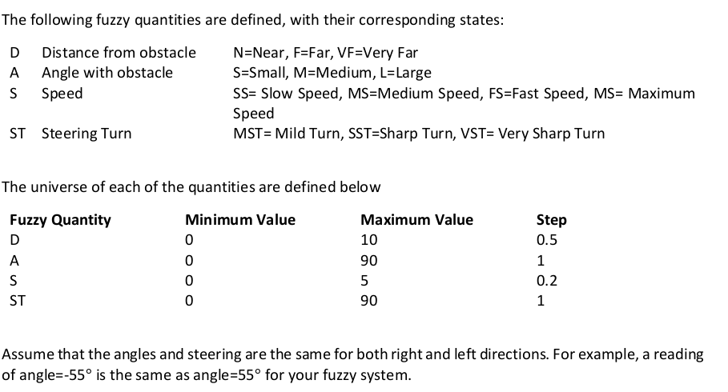

# Fuzzy_inference_system

robot is navigating in an environment where there are obstacles it needs to avoid. The robot is equipped
with sensors that can detect the obstacle. It also relays the distance and angle relative to the robot. Using
these measurements, create a fuzzy inferencing system to decide the Speed and Steering.

In your design, please consider the following preliminary behavior as a guide. Note that the system’s
behavior is not limited to these actions but must include them:
1) When an obstacle is detected, avoid it: does not matter which direction; left or right
2) When there is no obstacle move forward Speed is reduced when turning away from an obstacle
3) Speed is increased when cruising (when there is no obstacle)

1. Design a fuzzy system including:
a. The membership functions for each of the fuzzy quantities (following the provided states)
b. The rule base that will be used for inferencing
c. The inferencing system that will be used (Mamdani, Sugeno, etc...)
d. The defuzzification method
